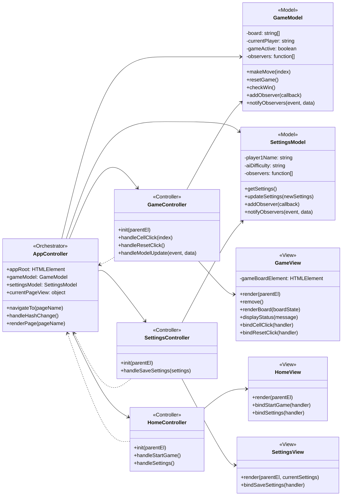

```mermaid
classDiagram
    direction LR

    %% Определение классов
    class AppController {
        <<Orchestrator>>
        +appRoot: HTMLElement
        +gameModel: GameModel
        +settingsModel: SettingsModel
        +currentPageView: object
        +navigateTo(pageName)
        +handleHashChange()
        +renderPage(pageName)
    }

    class GameModel {
        <<Model>>
        -board: string[]
        -currentPlayer: string
        -gameActive: boolean
        -observers: function[]
        +makeMove(index)
        +resetGame()
        +checkWin()
        +addObserver(callback)
        +notifyObservers(event, data)
    }

    class SettingsModel {
        <<Model>>
        -player1Name: string
        -aiDifficulty: string
        -observers: function[]
        +getSettings()
        +updateSettings(newSettings)
        +addObserver(callback)
        +notifyObservers(event, data)
    }

    class GameView {
        <<View>>
        -gameBoardElement: HTMLElement
        +render(parentEl)
        +remove()
        +renderBoard(boardState)
        +displayStatus(message)
        +bindCellClick(handler)
        +bindResetClick(handler)
    }

    class GameController {
        <<Controller>>
        +init(parentEl)
        +handleCellClick(index)
        +handleResetClick()
        +handleModelUpdate(event, data)
    }

    class HomeView {
        <<View>>
        +render(parentEl)
        +bindStartGame(handler)
        +bindSettings(handler)
    }

    class HomeController {
        <<Controller>>
        +init(parentEl)
        +handleStartGame()
        +handleSettings()
    }

    class SettingsView {
        <<View>>
        +render(parentEl, currentSettings)
        +bindSaveSettings(handler)
    }

    class SettingsController {
        <<Controller>>
        +init(parentEl)
        +handleSaveSettings(settings)
    }

    %% Определение связей
    AppController --> GameModel
    AppController --> SettingsModel
    AppController --> GameController
    AppController --> HomeController
    AppController --> SettingsController
    GameController ..> AppController
    HomeController ..> AppController
    SettingsController ..> AppController
    GameController --> GameModel
    GameController --> GameView
    HomeController --> HomeView
    SettingsController --> SettingsModel
    SettingsController --> SettingsView
```
