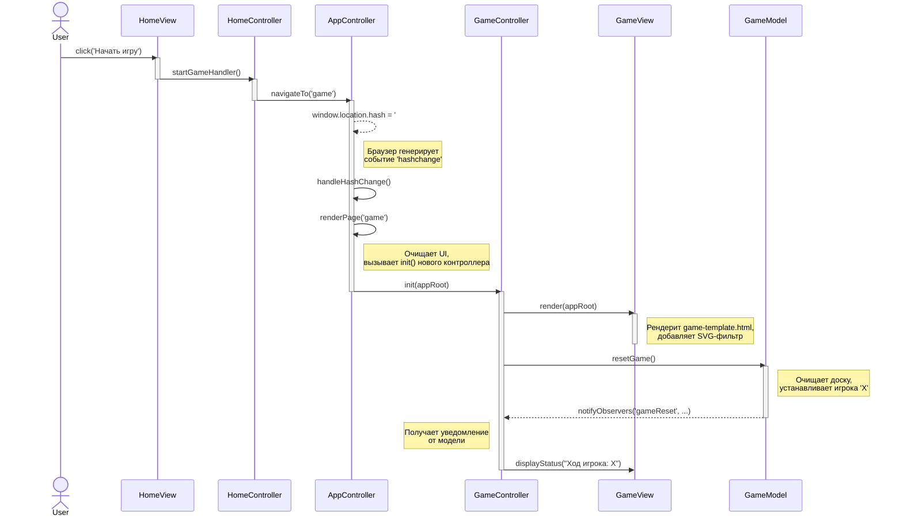

```mermaid
sequenceDiagram
    actor User
    participant HV as HomeView
    participant HC as HomeController
    participant AC as AppController
    participant GC as GameController
    participant GV as GameView
    participant GM as GameModel

    %% Начало игры
    User->>HV: click('Начать игру')
    activate HV
    HV->>HC: startGameHandler()
    deactivate HV

    %% Навигация
    activate HC
    HC->>AC: navigateTo('game')
    deactivate HC

    %% Обработка навигации
    activate AC
    AC-->>AC: window.location.hash = '#game'
    note right of AC: Браузер генерирует<br>событие 'hashchange'
    AC->>AC: handleHashChange()
    AC->>AC: renderPage('game')
    note right of AC: Очищает UI,<br>вызывает init() нового контроллера
    AC->>GC: init(appRoot)
    deactivate AC

    %% Инициализация игры
    activate GC
    GC->>GV: render(appRoot)
    activate GV
    note right of GV: Рендерит game-template.html,<br>добавляет SVG-фильтр
    deactivate GV

    %% Сброс игры
    GC->>GM: resetGame()
    activate GM
    note right of GM: Очищает доску,<br>устанавливает игрока 'X'
    GM-->>GC: notifyObservers('gameReset', ...)
    deactivate GM

    %% Отображение статуса
    note left of GC: Получает уведомление<br>от модели
    GC->>GV: displayStatus("Ход игрока: X")
    deactivate GC
```
